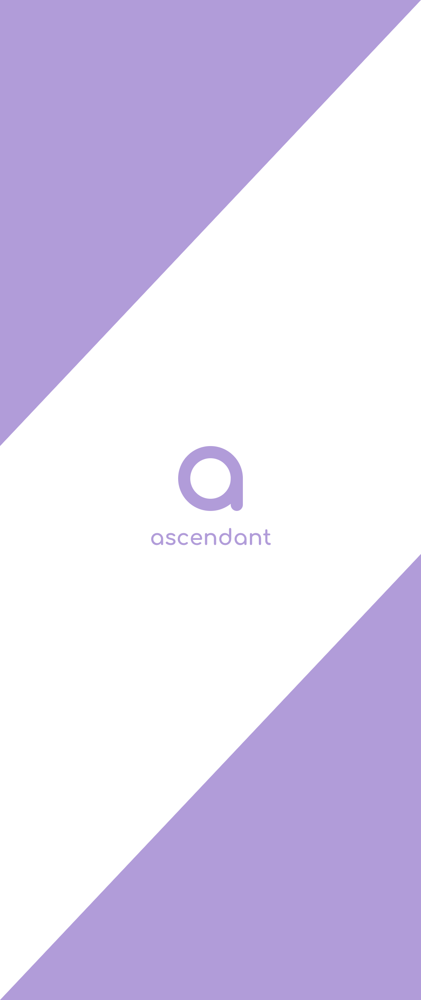
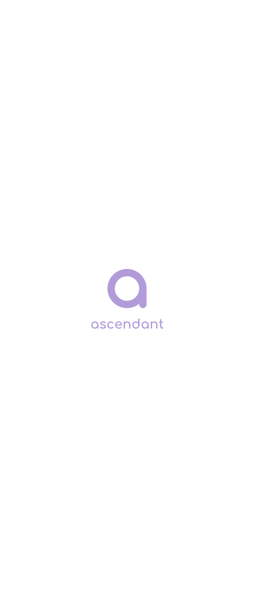

# Ascendant Designs
Here you can find logos, wallpapers and other stuff used in Ascendant ROM.  
Each design has JPG, PNG, SVG and .gvdesign files(except for wallpapers, wallpapers only have JPG, PNG and .gvdesign files), these designs also have JPG files with dark and light backgrounds, also the PNG files are transparent(except for wallpapers).

You are allowed to use these logos however you want, modify them, use them on your website, etc.

Note: If you want to modify some design, you need to open .gvdesign file in [designer.io](https://designer.io)

## Color used for all designs
There you go: #b19cd9  
This list might be longer in the future, but for now only one color is used

## Font used for all designs
Comfortaa Bold, you can find it [here](https://fonts.google.com/specimen/Comfortaa)

## logo-2
  
Ascendant logo

## logo-3
  
Ascendant logo with text

## logo-4
  
1024x512 header

## logo-5
  
1500x500 header for Twitter

## wallpaper-1
  
Full HD Ascendant wallpaper 1

## wallpaper-2
  
Full HD Ascendant wallpaper 2

## wallpaper-3
  
Full HD Ascendant wallpaper 3
